

<h1>DofE Skills - Blender Gallery</h1>

## Week 1 - Procedural Landscape Generation (Cycles)

The first image is my rendition of[this](https://www.youtube.com/watch?v=yrMee2gcS20) tutorial. I wasnsatisfied with my texturing, so I adapted the same technique with my own shader to create the low-poly Mars-like render on the right. Complete with martian birds! I've done some similar tests using animation nodes to warp amesh, which I think would be more efficient, however, it's been hard to getthe same easing in the height.

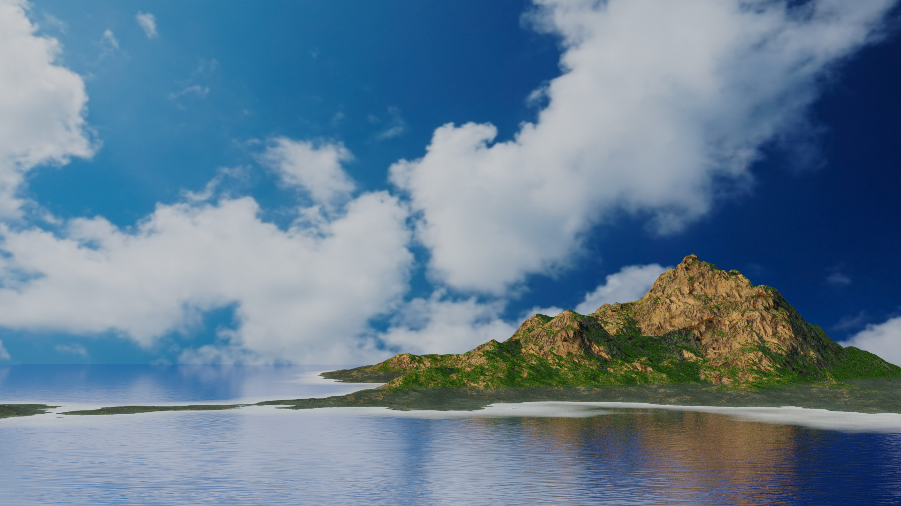
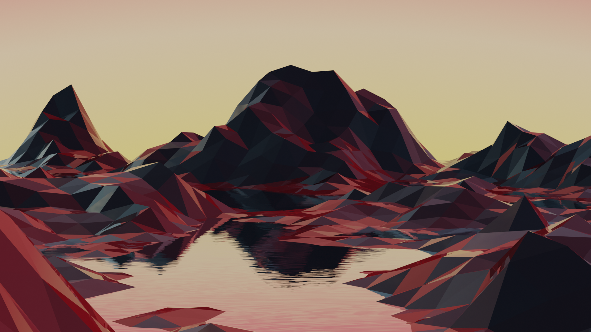 
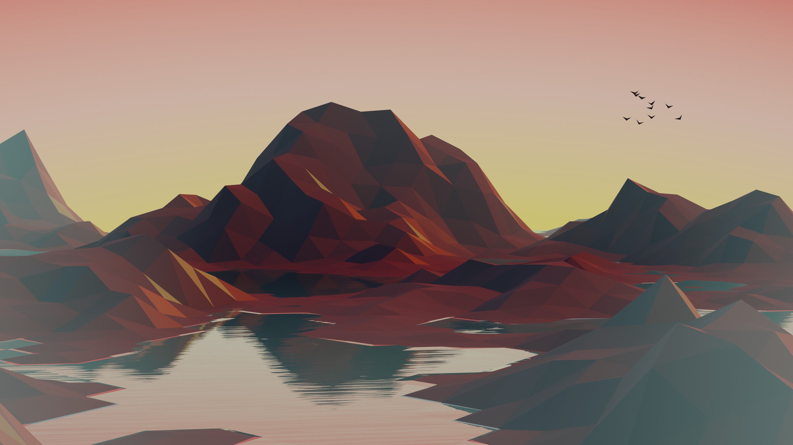 
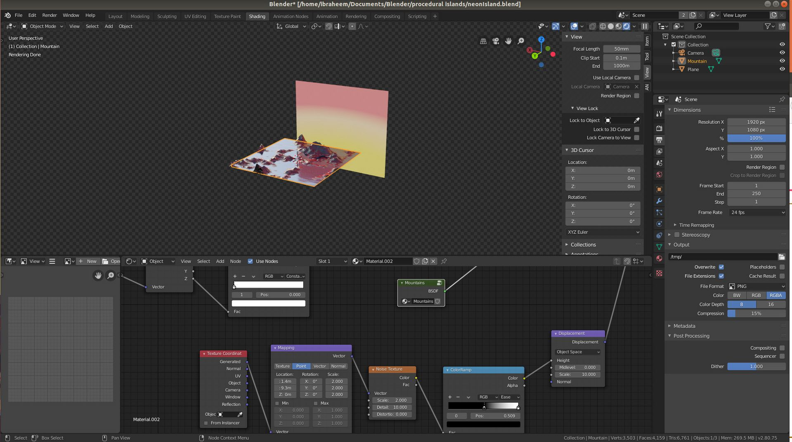 

## Week 2 - Seamless particle loop with Animation Nodes (EEVEE)

<iframe
  width="560"
  height="315"
  src="https://www.youtube.com/embed/BoYO8eSi9zY"
  frameborder="0"
  allow="accelerometer; autoplay; encrypted-media; gyroscope; picture-in-picture"
  allowfullscreen
></iframe>

This was my attempt to create a seamless particle loop using the mighty
Animation Nodes (best plugin!). No matter what I did I was unable to avoid a
small bit of stuttering at the looping point, but overall I'm pleased with the
result. 

## Week 3 - The DMate Device (EEVEE) A modeling and materials study
based on the aesthetic of camera lenses and watches.  

## Week 4 -
Procedural Stary Sky Wallpaper (EEVEE) Procedural textures are super cool. A few
minutes building a shader and BAM, infinite variation, infinite tiling, and no
repetition. To challenge my skills I made this stary sky wallpaper.

 

## Week 5 - Sparks Animation (Cycles)

<iframe
  width="560"
  height="315"
  src="https://www.youtube.com/embed/nHKcTwoF_Hc"
  frameborder="0"
  allow="accelerometer; autoplay; encrypted-media; gyroscope; picture-in-picture"
  allowfullscreen
></iframe>

I've been finding I'm overestimating my abilities and getting caught up, so for
the next few weeks I'm going to stick to following tutorials. This one was based
on [this](https://www.youtube.com/watch?v=MGRhJf0xdE8) tutorial by BlenderGuru.

## Week 6 - Realistic Rain (Cycles)

<iframe
  width="560"
  height="315"
  src="https://www.youtube.com/embed/NgksT1Nj0ms"
  frameborder="0"
  allow="accelerometer; autoplay; encrypted-media; gyroscope; picture-in-picture"
  allowfullscreen
></iframe>

This is probably by best render yet, and a fun one too. Based off of [this
tutorial](https://www.youtube.com/watch?v=35bbyAJodEQ). 

## Week 7 - Assorted Jars (Cycles) 

A few jars I had fun creating. Based off of [this tutorial](https://www.youtube.com/watch?v=DGKTk5wPIZM). 

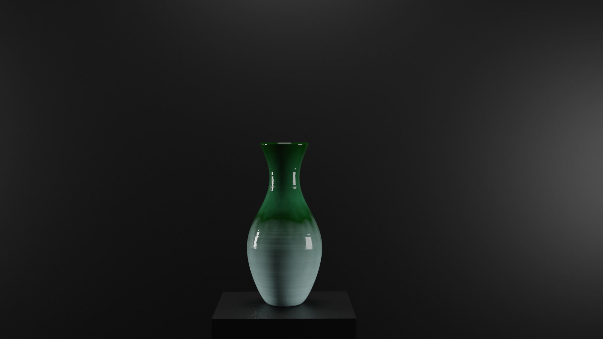
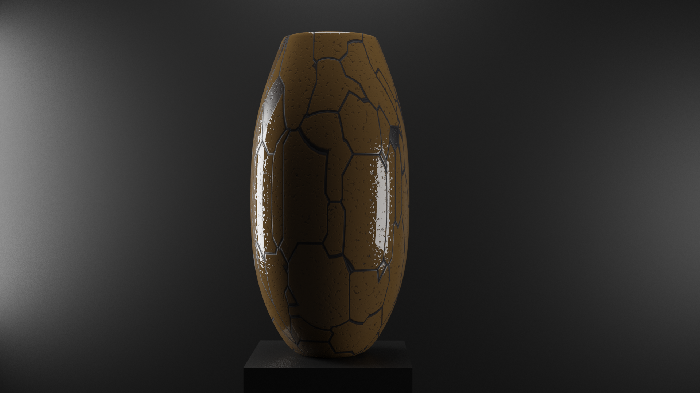 
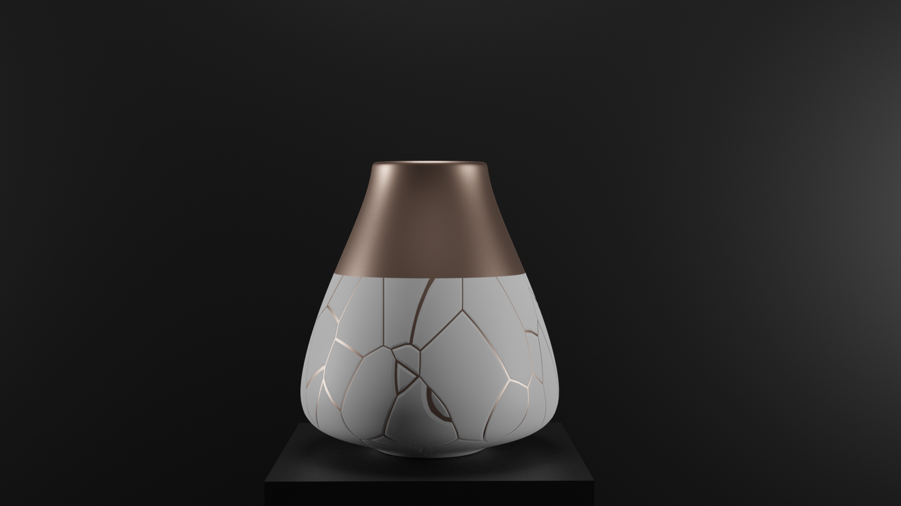 

## Week 8 - Clay Shader 

A clay shader I tested making, complete with procedural fingerprints. Based off of [this](https://www.youtube.com/watch?v=wTu3Xssw67Q). 

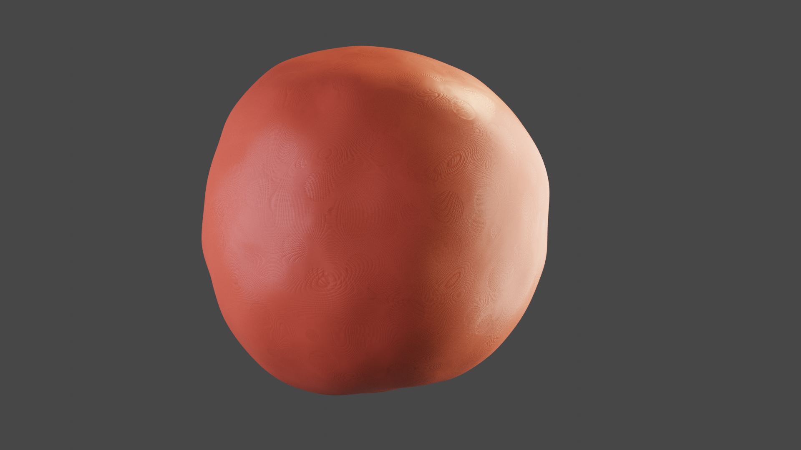 

## Week 9 - Low Poly Frog (Cycles) Pond. 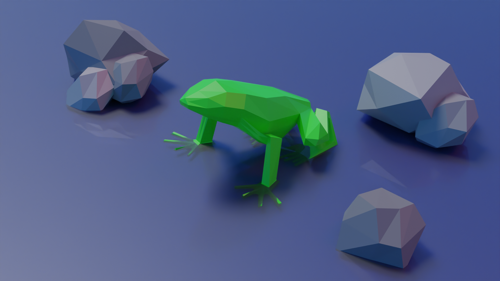 ## Week 10 - Seamless Loop (EEVEE)

<iframe
  width="560"
  height="315"
  src="https://www.youtube.com/embed/i0xbmFMcAzU"
  frameborder="0"
  allow="accelerometer; autoplay; encrypted-media; gyroscope; picture-in-picture"
  allowfullscreen
></iframe>

## Week 11 - Low Mountain (Cycles) 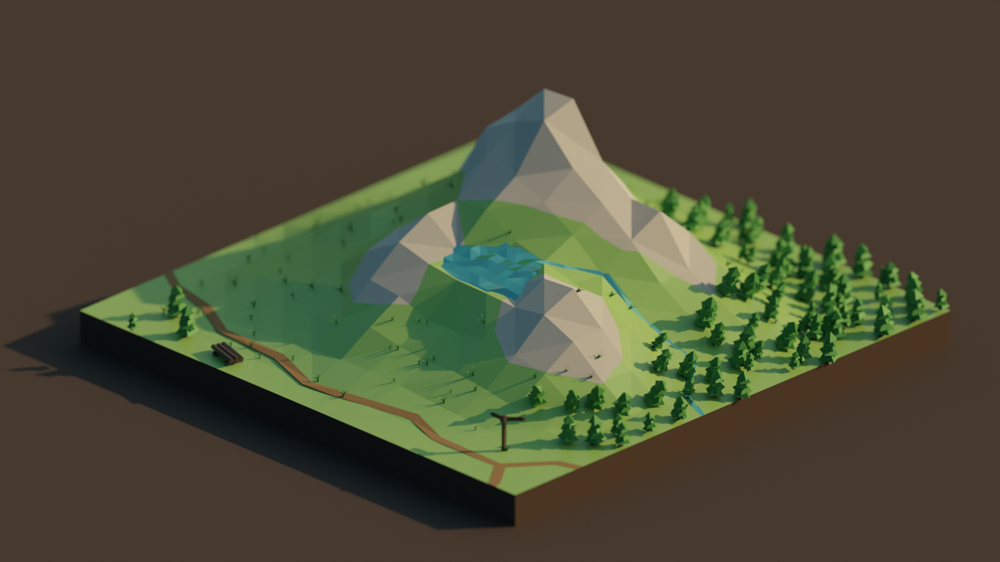 I've been following the work
of [Roman Klčo](https://romanklco.com/) on his YouTube channel Polygon Runway
for a while now, and I wanted to have a go at emulating his style. This comes
nowhere near to the level of detail he puts in, but I'm happy with the final
result. ## Week 12 & 13 - Halley VI Modeling (WIP) I've embarked on a project to
model the [Halley VI
Antarctic](https://www.bas.ac.uk/polar-operations/sites-and-facilities/facility/halley/)
research station in Blender. This will likely take me a few weeks, so here is a
WIP screenshot for the last two weeks showing my progress. 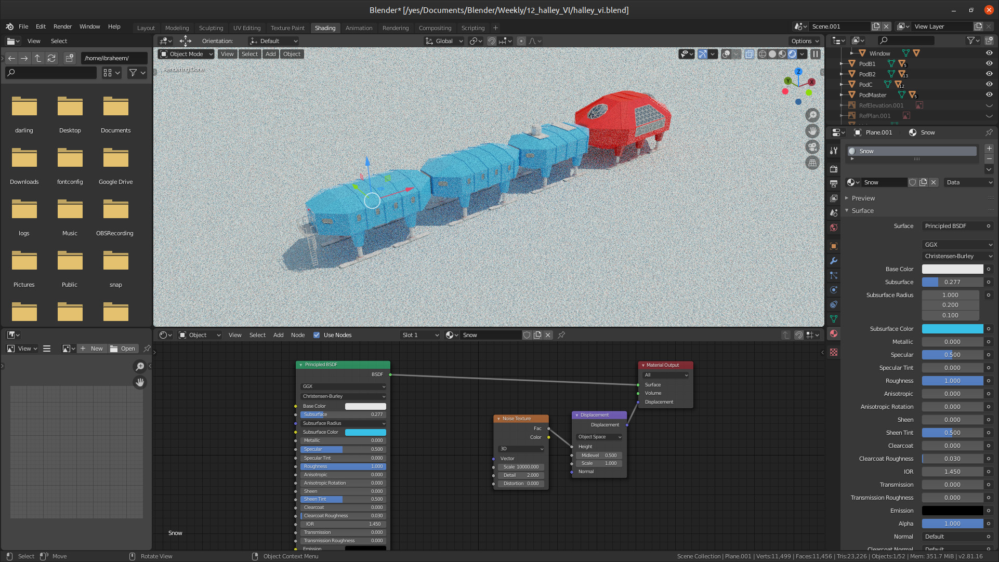 ##
Week 14 - Toroidal Annihilation

<iframe
  width="560"
  height="315"
  src="https://www.youtube.com/embed/9H9dEC7Tguk"
  frameborder="0"
  allow="accelerometer; autoplay; encrypted-media; gyroscope; picture-in-picture"
  allowfullscreen
></iframe>

I'm taking a break from Halley VI, and doing a smaller test. ## Week 15 - Some
Grease Pencil Tests

<iframe
  width="560"
  height="315"
  src="https://www.youtube.com/embed/QMHGSHN71Z8"
  frameborder="0"
  allow="accelerometer; autoplay; encrypted-media; gyroscope; picture-in-picture"
  allowfullscreen
></iframe>

<iframe
  width="560"
  height="315"
  src="https://www.youtube.com/embed/MWLH2A2KOYs"
  frameborder="0"
  allow="accelerometer; autoplay; encrypted-media; gyroscope; picture-in-picture"
  allowfullscreen
></iframe>

## Week 16 - Crystal

<iframe
  width="560"
  height="315"
  src="https://www.youtube.com/embed/q2NIgJqzots"
  frameborder="0"
  allow="accelerometer; autoplay; encrypted-media; gyroscope; picture-in-picture"
  allowfullscreen
></iframe>

## Week 17 - Cube Field (Cycles) 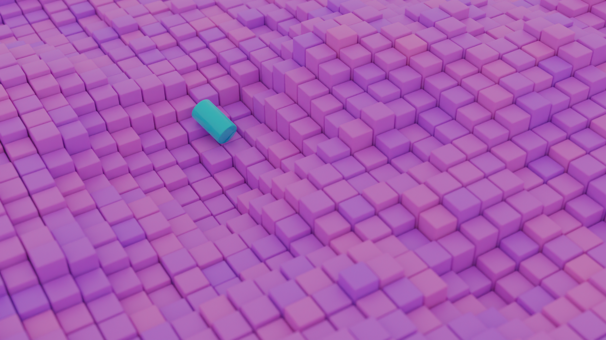
